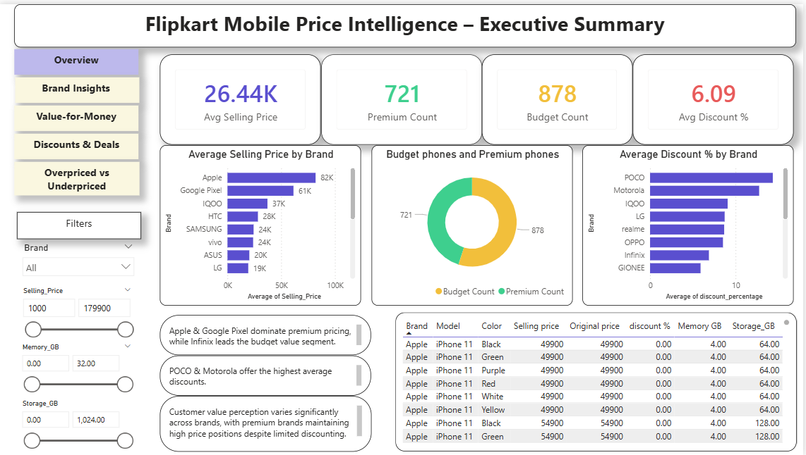
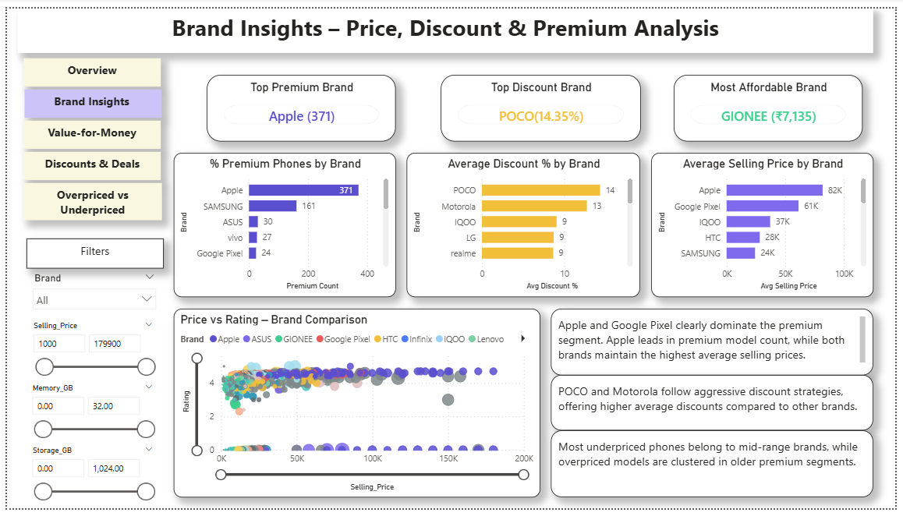
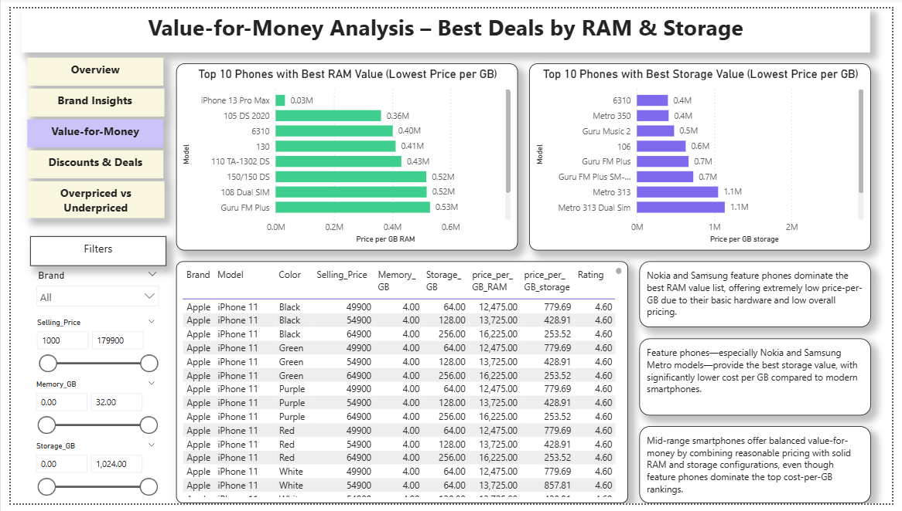
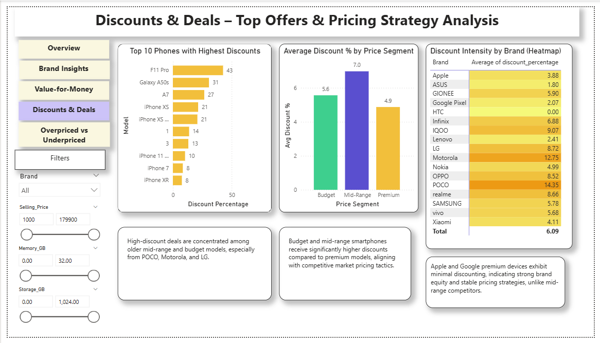
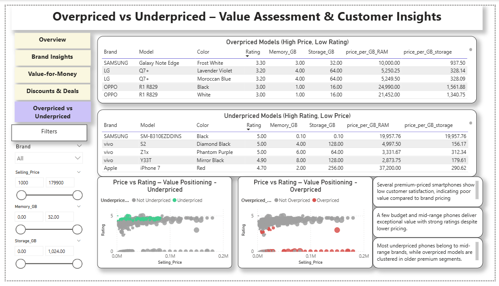

# 📊 Flipkart E-Commerce Pricing & Value Analysis – End-to-End BI System  
### 🔹 Author: Nagasudha S

---

## 📘 Project Overview
This project analyzes smartphone pricing, discounts, and customer value using a Kaggle Flipkart mobile dataset. Although a simple web-scraping demo is included to showcase capability, the full analysis is performed on the Kaggle dataset for accuracy and completeness.

Using Python, SQL, and Power BI, the project converts raw product listings into a pricing-intelligence system that answers important e-commerce business questions:

- Which brands price their phones at premium or budget levels?  
- Which models offer the best value (₹ per GB RAM / ₹ per GB Storage)?  
- How do discounts vary across brands and price segments?  
- Which products appear overpriced or underpriced based on rating vs. selling price?

This end-to-end workflow reflects real-world data practices used by pricing analysts and category teams: data cleaning → feature engineering → SQL analysis → BI dashboards → business insights.

---

## 🛠️ Tech Stack
- Python (Pandas, NumPy, Regex) – Cleaning & Feature Engineering  
- SQL Server – Business Analysis Queries  
- Power BI – Dashboarding & Insights  
- GitHub – Version Control & Documentation  

---

## 📂 Project Structure
flipkart-price-intelligence/  
│  
├── data/  
│   ├── raw/  
│   └── cleaned/  
│  
├── scripts/  
│   ├── 01_data_cleaning_and_preparation.ipynb  
│   └── scraper_demo.py  
│  
├── sql/  
│   └── FLIPKART_E_COMMERCE.sql  
│  
├── powerbi/  
│   ├── Flipkart Mobile Price Intelligence.pbix  
│   └── screenshots/  
│       ├── 01_overview.png  
│       ├── 02_brand_insights.png  
│       ├── 03_value_for_money.png  
│       ├── 04_discounts_and_deals.png  
│       └── 05_overpriced_vs_underpriced.png  
│  
└── docs/  
    └── cheatsheet/

---

## 🧹 Data Cleaning & Feature Engineering (Python)
Key steps performed:

- Converted RAM & Storage values from MB/GB/TB into standardized GB format  
- Cleaned missing values  
- Extracted numeric values from inconsistent strings  
- Engineered business features:

**Engineered Columns:**  
- discount_percentage  
- price_gap  
- Memory_GB  
- Storage_GB  
- price_per_GB_RAM  
- price_per_GB_storage  
- premium_flag  
- budget_flag  

---

## 🗄️ SQL Business Analysis
The cleaned dataset was imported into SQL Server for structured analytical queries.

Key SQL insights include:

- Average selling price by brand  
- Discount patterns by brand  
- Premium vs budget segmentation  
- Overpriced vs underpriced classification  
- Value-for-money metric comparisons  
- Price–rating correlation analysis

---

## 📊 Power BI Dashboard (5 Pages)

### 1️⃣ Executive Summary  

### 2️⃣ Brand Insights  

### 3️⃣ Value for Money  

### 4️⃣ Discounts & Deals  

### 5️⃣ Overpriced vs Underpriced  

---

## 💡 Key Business Insights
- Apple & Google Pixel dominate premium pricing with minimal discounting  
- POCO & Motorola follow aggressive discount strategies  
- Nokia & Samsung feature phones deliver the strongest value (₹ per GB)  
- Mid-range smartphones offer balanced value-for-money  
- Older premium models often appear overpriced  
- Several mid-range models rank as highly underpriced relative to ratings  

---

## 📥 Power BI File
PBIX included in repo:  
`powerbi/Flipkart Mobile Price Intelligence.pbix`

---

## 🚀 How to Run the Project

### Python  
Run the notebook:  
`scripts/01_data_cleaning_and_preparation.ipynb`

### SQL  
Run queries:  
`sql/FLIPKART_E_COMMERCE.sql`

### Power BI  
Open the PBIX file:  
`powerbi/Flipkart Mobile Price Intelligence.pbix`

---

## 👤 About the Author
**Nagasudha S**  
Data Analyst – SQL | Python | Power BI  
Focused on business storytelling and analytics-driven insights.

